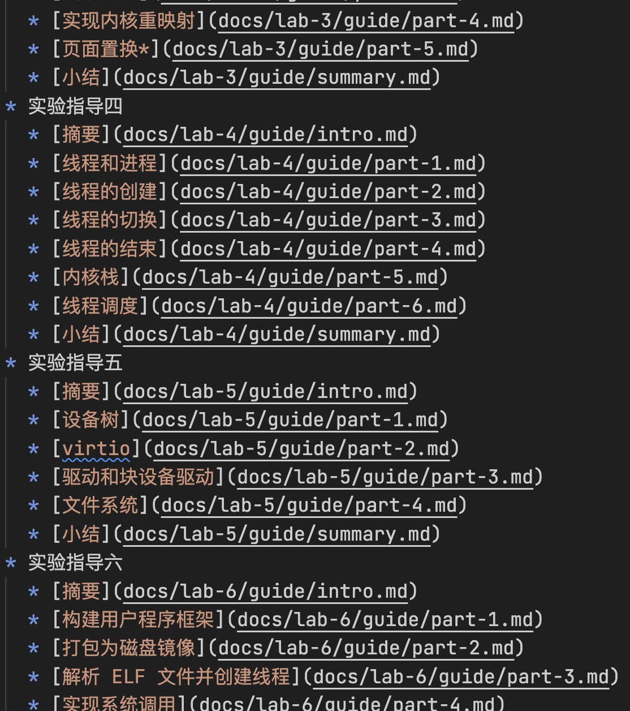
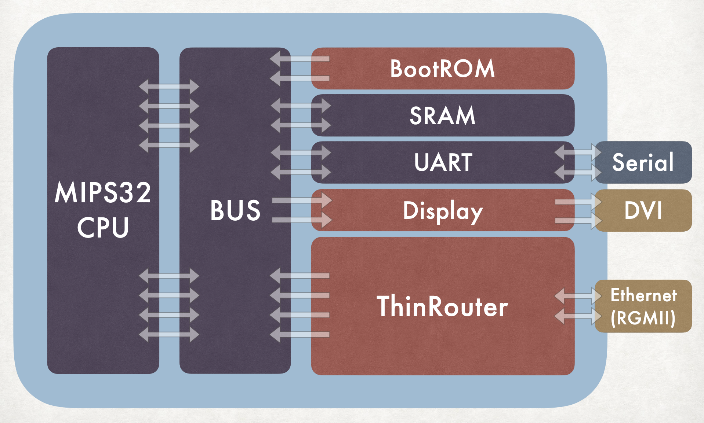

[English version (WIP)]()

## 技术栈

### 按编程语言

|             语言              | 总代码量 | 运用过的高级语言特性                                                                                      |
| :---------------------------: | :------: | :-------------------------------------------------------------------------------------------------------- |
|            Python             |   >10k   | generator   decorator   context   multiprocessing   metaclass                         |
|              C++              |   >10k   | OOP   template   smart pointer   lambda   reference (lvalue, rvalue)   multithreading |
| JavaScript   (TypeScript) |   >10k   | closure   promise   prototype   typing                                                        |
|             Rust              |   ~2k    | ownership   trait   macro                                                                         |
|             Java              |   ~2k    | stream   reactor                                                                                      |
|         SystemVerilog         |   ~4k    |                                                                                                           |

### 按应用场景

#### 服务器

- 后端逻辑
  - Flask （例：[WDK-Pro-League](https://github.com/Tuyixiang/WDK-Pro-League)）
  - Django（例：[新闻爬虫+搜索引擎](https://github.com/Tuyixiang/2018.8-Practice-3)）
- 部署
  - Docker（例：[web 联机游戏](#se)）
- 网关
  - Nginx
- 数据库
  - MongoDB
  - SQLite
- 其他
  - Ubuntu 使用

#### 前端

- web
  - Vue.js（例：[web 联机游戏](#se)）
  - Flutter（例：[WDK-Pro-League](https://github.com/Tuyixiang/WDK-Pro-League)）
- PC
  - Qt
  - Electron

#### AI

- 工具
  - tensorflow
  - Keras
  - scikit-learn
- 模型
  - 决策树
  - SVM
  - 神经网络
    - CNN
    - RNN
    - Attention
    - Transformer
- 概念
  - 强化学习
  - 对抗学习
  - 集成学习

#### 数据

- 整理分析
  - pandas
  - NumPy
  - scikit-learn
- 可视化
  - Plotly

## 部分项目展示

|                     展示                     | 介绍                                                                                                                                                                                                                                                                                                                                                                                                                                                    |
| :------------------------------------------: | :------------------------------------------------------------------------------------------------------------------------------------------------------------------------------------------------------------------------------------------------------------------------------------------------------------------------------------------------------------------------------------------------------------------------------------------------------ |
|                   | [**教学操作系统**（rCore-Tutorial）](https://github.com/rcore-os/rCore-Tutorial)    由 Rust 从零编写的操作系统，实现了满足教学要求的各种基础功能，并编写了配套实验教程。    团队成员： 涂轶翔 [@Tuyixiang](https://github.com/Tuyixiang) 赵成钢 [@LyricZhao](https://github.com/LyricZhao)                                                                                                                                      |
|             | [**自制 CPU + 路由器**（ThinRouter）](https://github.com/Tuyixiang/ThinRouter)    在 FPGA 上实现可运行 C 语言程序的 CPU，和支持 IPv4 通信的路由器。    团队成员： 涂轶翔 [@Tuyixiang](https://github.com/Tuyixiang) 王征翊 [@thuwzy](https://github.com/thuwzy) 赵成钢 [@LyricZhao](https://github.com/LyricZhao)                                                                                                           |
|  | **web 联机游戏**    [项目结构说明](ref/SE.pdf)   项目包括前后端、用户管理、游戏大厅和房间等逻辑，使用 Vue.js，Pixi.js，Express 等框架。    团队成员： 顾煜贤 [@t1101675](https://github.com/t1101675) 涂轶翔 [@Tuyixiang](https://github.com/Tuyixiang) 邢健开 [@jkxing](https://github.com/jkxing) 张晨 [@heheda12345](https://github.com/heheda12345) 赵成钢 [@LyricZhao](https://github.com/LyricZhao)   |
